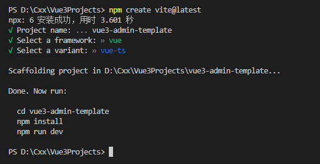

# 项目说明
&emsp;&emsp;`Vue3-admin-template`是一个后台前端解决方案，基于最新(`2022`年)的前端技术构建，可以直接基于此项目进行二次开发。   

# 技术栈
1. 前端框架：[`Vue3`](https://v3.cn.vuejs.org/)     
2. UI 组件库：[`Element Plus`](https://element-plus.gitee.io/zh-CN/)    
3. 路由管理：[`Vue Router v4`](https://router.vuejs.org/zh/)      
4. 状态管理：[`Pinia`](https://pinia.vuejs.org/)    
5. 网络管理：[`axios`](https://www.axios-http.cn/) 
6. 前端开发与构建工具：[`Vite v2`](https://vitejs.cn/)         
7. 编程语言：`TypeScript`

# 初始化项目
## 新建项目
&emsp;&emsp;打开终端输入：   
```cmd
npm create vite@latest
```

&emsp;&emsp;依次输入项目名称、框架即可。    
  
&emsp;&emsp;这里选择`vue + ts`。

## 启动项目
### 安装依赖包   
```cmd
npm install
```

### 运行
```cmd
npm run dev
```

## 精简项目
* index.html  

&emsp;&emsp;将`<title>`更改为`vue3-admin-template`。   

* src->App.vue

&emsp;&emsp;删除`<script>`、`<template>`和`<style>`中的内容。
```html
<script setup lang="ts">

</script>

<template>

</template>

<style>

</style>
```

* src->components->HelloWorld.vue

&emsp;&emsp;删除该组件。    

# 项目实现——极简版
[极简版实现](./项目说明/极简版实现.md)

# 项目实现——标准版
## 全局图标系统


# 项目实现——完整版

# 参考资料
1. [Vite + Vue3 初体验 —— Vite 篇](https://www.jianshu.com/p/e3cb446ccde9)    
2. [PanJiaChen/vue-element-admin](https://github.com/PanJiaChen/vue-element-admin)    
  