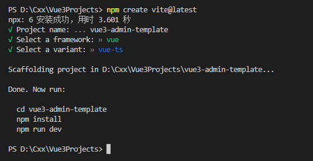
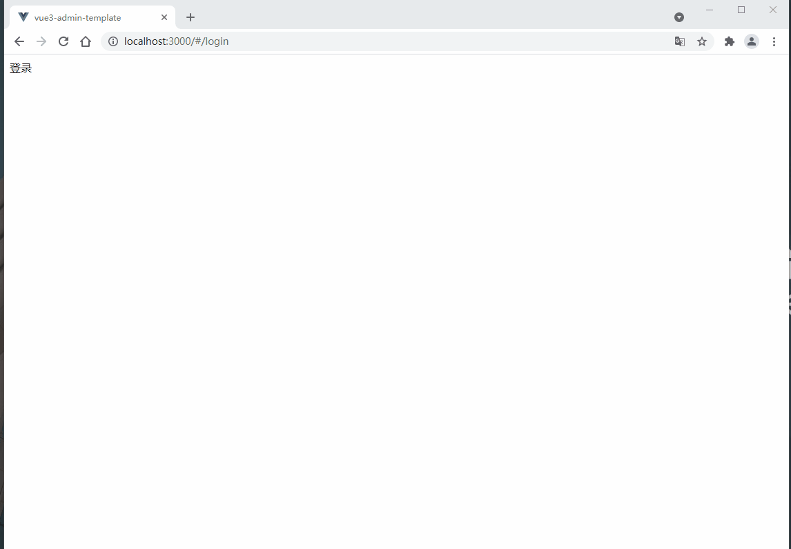
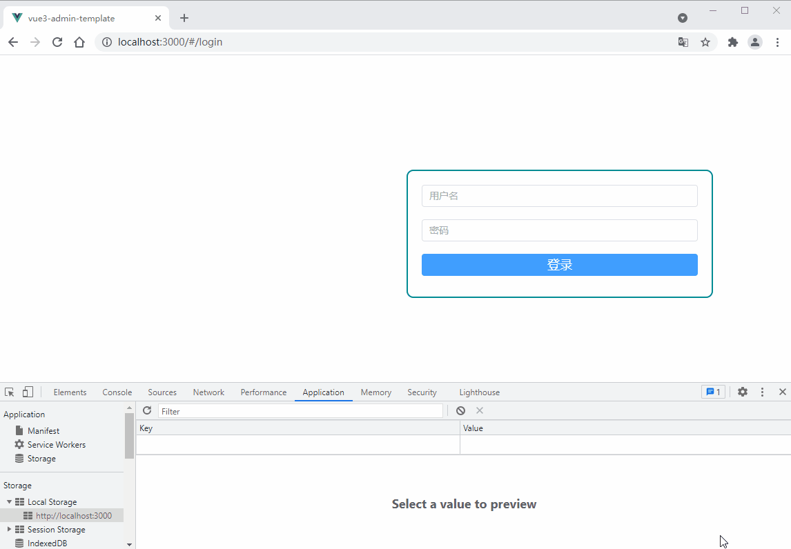
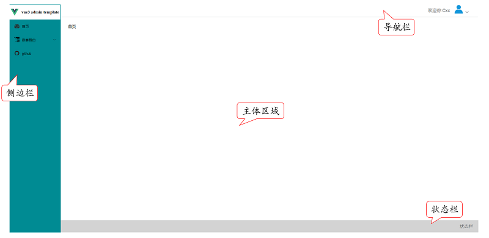

# 项目说明
&emsp;&emsp;`Vue3-admin-template`是一个后台前端解决方案，基于最新(`2022`年)的前端技术构建，可以直接基于此项目进行二次开发。   

# 技术栈
1. 前端框架：[`Vue3`](https://v3.cn.vuejs.org/)     
2. UI 组件库：[`Element Plus`](https://element-plus.gitee.io/zh-CN/)    
3. 路由管理：[`Vue Router v4`](https://router.vuejs.org/zh/)      
4. 状态管理：[`Pinia`](https://pinia.vuejs.org/)    
5. 网络管理：[`axios`](https://www.axios-http.cn/) 
6. 前端开发与构建工具：[`Vite v2`](https://vitejs.cn/)         
7. 编程语言：`TypeScript`

# 初始化项目
## 新建项目
&emsp;&emsp;打开终端输入：   
```cmd
npm create vite@latest
```

&emsp;&emsp;依次输入项目名称、框架即可。    
  
&emsp;&emsp;这里选择`vue + ts`。

## 启动项目
### 安装依赖包   
```cmd
npm install
```

### 运行
```cmd
npm run dev
```

## 精简项目
* index.html  

&emsp;&emsp;将`<title>`更改为`vue3-admin-template`。   

* src->App.vue

&emsp;&emsp;删除`<script>`、`<template>`和`<style>`中的内容。
```html
<script setup lang="ts">

</script>

<template>

</template>

<style>

</style>
```

* src->components->HelloWorld.vue

&emsp;&emsp;删除该组件。    

# 项目实现——极简版
## 路由配置
### 安装
```cmd
npm install vue-router@4
```

### 新建登录页面
&emsp;&emsp;`src->views->login->index.vue`   
```html
<template>
  登录
</template>

<script setup lang="ts">
</script>

<style>
</style>
```

&emsp;&emsp;`views`文件夹通常存放的是页面级文件。  

### 新建首页页面
&emsp;&emsp;`src->views->dashbord->index.vue` 
```html
<template>
  首页
</template>

<script setup lang="ts">
</script>

<style>
</style>
```

### 新建全局布局系统
&emsp;&emsp;新建`src->layout->components`文件夹。   
&emsp;&emsp;新建`src->layout->index.vue`：
```html
<template>
  <!-- 路由显示 -->
  <router-view/>
</template>

<script setup lang="ts">
</script>

<style>
</style>
```

### 新建路由配置文件
&emsp;&emsp;新建`src->router->index.ts`    
```ts
import { createRouter, createWebHashHistory, RouteRecordRaw } from 'vue-router'

// 导入全局布局组件
import Layout from '@/layout/index.vue'

export const constantRoutes: Array<RouteRecordRaw> | any = [
  // 登录路由
  {
    path: '/login',
    // 引入登录页面
    component: () => import('@/views/login/index.vue'),
    hidden: true
  },
  // 首页路由
  {
    path: '/',
    // 使用全局组件布局
    component: Layout,
    redirect: '/dashboard',
    children: [
      {
        path: 'dashboard',
        // 引入首页页面
        component: () => import('@/views/dashboard/index.vue'),
        name: 'Dashboard',
        meta: { title: '首页', noCache: true, icon: 'dashboard', affix: true }
      }
    ]
  }
]

const router = createRouter({
  history: createWebHashHistory(),
  scrollBehavior: () => ({ top: 0 }),
  routes: constantRoutes
})

export default router
```

&emsp;&emsp;这里需要设置`src`文件夹别名为`@`：
* 增加`tsconfig.json`的`compilerOptions`键值对：

```json
// 设置 @ 路径
"baseUrl": ".",
"paths": {
  "@/*": [
    "src/*"
  ]
}
```

* 修改`vite.config.ts`

```ts
import { defineConfig } from 'vite'
import vue from '@vitejs/plugin-vue'

// 导入path
const path = require('path');

// https://vitejs.dev/config/
export default defineConfig({
  plugins: [vue()],
  resolve: {
    // 配置路径别名
    alias: {
      '@': path.resolve(__dirname, './src'),
    },
  },
})
```

* 如果`Vscode`编译器报错，需要安装依赖包：

```cmd
npm i @types/node --D
```

### 修改App.vue
```html
<template>
  <div id="app">
    <!-- 路由显示 -->
    <router-view/>
  </div>
</template>

<style>

</style>
```

### 修改main.ts文件
```ts
import { createApp } from 'vue'

// 引入Vue App
import App from './App.vue'

// 引入路由
import router from './router'

// 创建Vue3实例
const app = createApp(App)

// 使用路由
app.use(router)
// 挂载到根组件上
app.mount('#app')
```

&emsp;&emsp;实际效果图：   

&emsp;&emsp;如果所示，在地址栏输入`/login`和`/`即可切换路由。     

### 配置初始路由为登录页
&emsp;&emsp;添加`src->permission.ts`：   
```ts
import router from '@/router/index'

router.beforeEach((to, from, next) => {
  const username = localStorage.getItem('username')
  if (to.path !== '/login' && !username) next({ path: '/login' })
  else next()
})
```

&emsp;&emsp;当路由指向不是登录页且没有用户名信息时，将路由强制跳转至登录页，否则放行。     

&emsp;&emsp;`main.ts`：
```ts
import '@/permission'
```

&emsp;&emsp;注：这里只是简单示例，没有添加实际的业务需求。下同。          

## 其他配置
### ELement UI Plus配置
* 安装   

```cmd
npm install element-plus --save
```

* 配置   

&emsp;&emsp;`main.ts`
```ts
// 引入element-ui组件
import ElementPlus from 'element-plus'
import 'element-plus/dist/index.css'
import 'dayjs/locale/zh-cn' // 中文
import locale from 'element-plus/lib/locale/lang/zh-cn' // 中文

// 创建Vue3实例
const app = createApp(App)
// 使用Element UI Plus
app.use(ElementPlus, { locale })
// 挂载到根组件上
app.mount('#app')
```

### scss配置
* 安装  

```cmd
npm i sass --save-dev
```

### ESLint配置
* 安装   

```cmd
npm install eslint --save-dev
npm init @eslint/config
```

* 更新`rules`：

&emsp;&emsp;详见`Github`项目地址中的`.eslintrc.js`文件。     
&emsp;&emsp;在`Vscode`编译器中安装`ESLint`插件，并打开配置文件`settings`(`ctrl+shift+p`)，增加以下配置信息：
```json
// eslint配置
"eslint.validate": [
    "javascript",
    "javascriptreact",
    "vue",
    "typescript"
],
"eslint.format.enable": true,
"eslint.alwaysShowStatus": true,
"editor.codeActionsOnSave": {
    "source.fixAll": true,
    "eslint.autoFixOnSave" : true,
}
```

&emsp;&emsp;注：如果`eslint`没有运行，可以打开`Vscode`编译器右下角的`ESlint`终端查找错误。    

## 登录页面
&emsp;&emsp;`src->views->login->index.vue`
```html
<template>
  <div class="login-container">
    <!-- 登录表单 -->
    <el-form
      ref="loginFormRef"
      :model="loginInfo.loginForm"
      class="login-form"
    >
      <!-- username表单选项 -->
      <el-form-item prop="username">
        <!-- username输入框 -->
        <el-input
          v-model="loginInfo.loginForm.username"
          placeholder="用户名"
        />
      </el-form-item>

      <!-- password表单选项 -->
      <el-form-item prop="password">
        <!-- password输入框 -->
        <el-input
          v-model="loginInfo.loginForm.password"
          placeholder="密码"
        />
      </el-form-item>

      <!-- 登录按钮 -->
      <el-button
        type="primary"
        style="width:100%;margin-bottom:30px;font-size:18px"
        @click.prevent="handleLogin(loginFormRef)"
      >登录</el-button>
    </el-form>
  </div>
</template>

<script setup lang="ts">
import { reactive, ref } from 'vue'
import { useRouter } from 'vue-router'

import { ElMessage } from 'element-plus'
import type { ElForm } from 'element-plus'

// 表单引用 固定格式
type FormInstance = InstanceType<typeof ElForm>
const loginFormRef = ref<FormInstance>()

const router = useRouter()

// 登录页面数据
const loginInfo = reactive({
  loginForm: {
    username: '',
    password: ''
  }
})

// 处理登录事件
// 这里需要传入表单的ref
const handleLogin = (formEl: FormInstance | undefined) => {
  if (!formEl) return
  formEl.validate((valid) => {
    if (valid) {
      if (loginInfo.loginForm.username.trim() !== '' && loginInfo.loginForm.password.trim() !== '') {
        localStorage.setItem('username', loginInfo.loginForm.username)
        // 跳转至首页
        router.push({ path: '/dashboard' || '/' })
        ElMessage.success('登录成功')
      } else {
        ElMessage.error('请输入正确的用户名和密码')
      }
    } else {
      ElMessage.error('请输入正确的用户名和密码')
      return false
    }
  })
}
</script>

<style lang="scss" scoped>
.login-container {
  min-height: 100%;
  width: 100%;
  overflow: hidden;

  background-color: white;

  .login-form {
    // 表单靠右居中
    position: absolute;
    right: 10%;
    top: 35%;

    width: 400px;
    max-width: 100%;
    padding: 20px 20px 0;
    margin: 0 auto;
    overflow: hidden;

    // 添加外边框
    border-radius: 10px;
    border: 2px solid #008B93;
  }
}
</style>
```
   
     
&emsp;&emsp;这里只做了简单的表单验证，如果成功则跳转至首页，并在浏览器中记录用户名信息。    

## 全局布局组件系统

```html
<template>
  <!-- 全局布局组件 -->
  <div class="app-wrapper">
    <!-- 侧边栏组件 -->
    <Sidebar class="sidebar-container"/>
    <!-- 主体区域 -->
    <div class="main-container">
      <!-- 导航栏 -->
      <navbar class="navbar-container"/>
      <!-- 页面主体区域 -->
      <app-main />
      <!-- 状态栏 -->
      <Footerbar class="footerbar-container"/>
    </div>
  </div>
</template>
```

&emsp;&emsp;这里只显示布局文件和脚本文件，样式文件详见`Github`项目地址。下同。    
&emsp;&emsp;全局布局文件整体分为侧边栏、导航栏、页面主体区域和状态栏四个部分。具体位置见上图所示。               

### 菜单栏组件系统


### 导航栏组件系统


# 项目实现——标准版
## 全局图标系统


# 项目实现——完整版

# 参考资料
1. [Vite + Vue3 初体验 —— Vite 篇](https://www.jianshu.com/p/e3cb446ccde9)    
2. [PanJiaChen/vue-element-admin](https://github.com/PanJiaChen/vue-element-admin)    
  