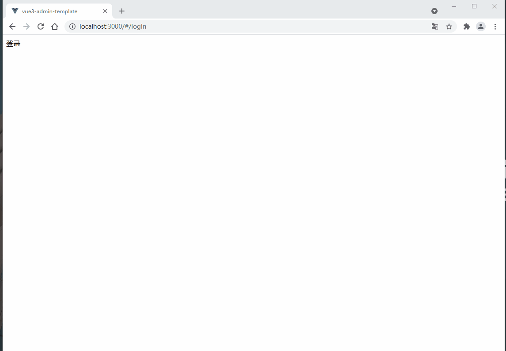
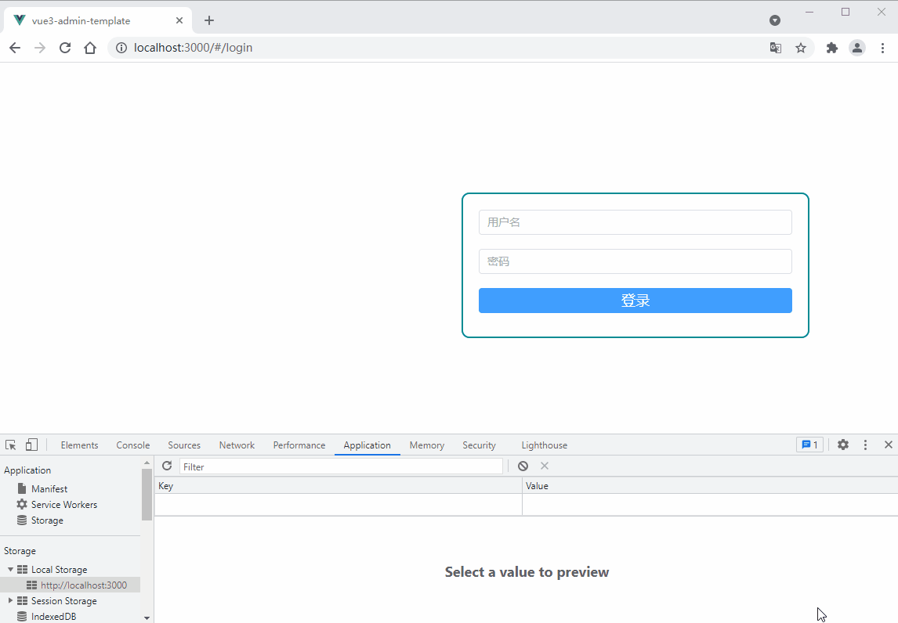
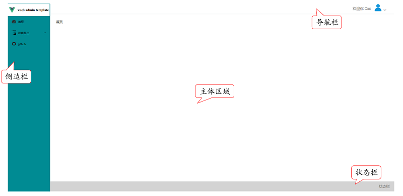
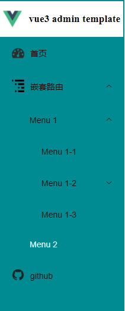

# 项目实现——极简版
## 路由配置
### 安装
```cmd
npm install vue-router@4
```

### 新建登录页面
&emsp;&emsp;`src->views->login->index.vue`   
```html
<template>
  登录
</template>

<script setup lang="ts">
</script>

<style>
</style>
```

&emsp;&emsp;`views`文件夹通常存放的是页面级文件。  

### 新建首页页面
&emsp;&emsp;`src->views->dashbord->index.vue` 
```html
<template>
  首页
</template>

<script setup lang="ts">
</script>

<style>
</style>
```

### 新建全局布局系统
&emsp;&emsp;新建`src->layout->components`文件夹。   
&emsp;&emsp;新建`src->layout->index.vue`：
```html
<template>
  <!-- 路由显示 -->
  <router-view/>
</template>

<script setup lang="ts">
</script>

<style>
</style>
```

### 新建路由配置文件
&emsp;&emsp;新建`src->router->index.ts`    
```ts
import { createRouter, createWebHashHistory, RouteRecordRaw } from 'vue-router'

// 导入全局布局组件
import Layout from '@/layout/index.vue'

export const constantRoutes: Array<RouteRecordRaw> | any = [
  // 登录路由
  {
    path: '/login',
    // 引入登录页面
    component: () => import('@/views/login/index.vue'),
    hidden: true
  },
  // 首页路由
  {
    path: '/',
    // 使用全局组件布局
    component: Layout,
    redirect: '/dashboard',
    children: [
      {
        path: 'dashboard',
        // 引入首页页面
        component: () => import('@/views/dashboard/index.vue'),
        name: 'Dashboard',
        meta: { title: '首页', noCache: true, icon: 'dashboard', affix: true }
      }
    ]
  }
]

const router = createRouter({
  history: createWebHashHistory(),
  scrollBehavior: () => ({ top: 0 }),
  routes: constantRoutes
})

export default router
```

&emsp;&emsp;这里需要设置`src`文件夹别名为`@`：
* 增加`tsconfig.json`的`compilerOptions`键值对：

```json
// 设置 @ 路径
"baseUrl": ".",
"paths": {
  "@/*": [
    "src/*"
  ]
}
```

* 修改`vite.config.ts`

```ts
import { defineConfig } from 'vite'
import vue from '@vitejs/plugin-vue'

// 导入path
const path = require('path');

// https://vitejs.dev/config/
export default defineConfig({
  plugins: [vue()],
  resolve: {
    // 配置路径别名
    alias: {
      '@': path.resolve(__dirname, './src'),
    },
  },
})
```

* 如果`Vscode`编译器报错，需要安装依赖包：

```cmd
npm i @types/node --D
```

### 修改App.vue
```html
<template>
  <div id="app">
    <!-- 路由显示 -->
    <router-view/>
  </div>
</template>

<style>

</style>
```

### 修改main.ts文件
```ts
import { createApp } from 'vue'

// 引入Vue App
import App from './App.vue'

// 引入路由
import router from './router'

// 创建Vue3实例
const app = createApp(App)

// 使用路由
app.use(router)
// 挂载到根组件上
app.mount('#app')
```

&emsp;&emsp;实际效果图：   

&emsp;&emsp;如果所示，在地址栏输入`/login`和`/`即可切换路由。     

### 配置初始路由为登录页
&emsp;&emsp;添加`src->permission.ts`：   
```ts
import router from '@/router/index'

router.beforeEach((to, from, next) => {
  const username = localStorage.getItem('username')
  if (to.path !== '/login' && !username) next({ path: '/login' })
  else next()
})
```

&emsp;&emsp;当路由指向不是登录页且没有用户名信息时，将路由强制跳转至登录页，否则放行。     

&emsp;&emsp;`main.ts`：
```ts
import '@/permission'
```

&emsp;&emsp;注：这里只是简单示例，没有添加实际的业务需求。下同。          

## 其他配置
### ELement UI Plus配置
* 安装   

```cmd
npm install element-plus --save
```

* 配置   

&emsp;&emsp;`main.ts`
```ts
// 引入element-ui组件
import ElementPlus from 'element-plus'
import 'element-plus/dist/index.css'
import 'dayjs/locale/zh-cn' // 中文
import locale from 'element-plus/lib/locale/lang/zh-cn' // 中文

// 创建Vue3实例
const app = createApp(App)
// 使用Element UI Plus
app.use(ElementPlus, { locale })
// 挂载到根组件上
app.mount('#app')
```

### scss配置
* 安装  

```cmd
npm i sass --save-dev
```

### ESLint配置
* 安装   

```cmd
npm install eslint --save-dev
npm init @eslint/config
```

* 更新`rules`：

&emsp;&emsp;详见`Github`项目地址中的`.eslintrc.js`文件。     
&emsp;&emsp;在`Vscode`编译器中安装`ESLint`插件，并打开配置文件`settings`(`ctrl+shift+p`)，增加以下配置信息：
```json
// eslint配置
"eslint.validate": [
    "javascript",
    "javascriptreact",
    "vue",
    "typescript"
],
"eslint.format.enable": true,
"eslint.alwaysShowStatus": true,
"editor.codeActionsOnSave": {
    "source.fixAll": true,
    "eslint.autoFixOnSave" : true,
}
```

&emsp;&emsp;注：如果`eslint`没有运行，可以打开`Vscode`编译器右下角的`ESlint`终端查找错误。    

## 登录页面
&emsp;&emsp;`src->views->login->index.vue`
```html
<template>
  <div class="login-container">
    <!-- 登录表单 -->
    <el-form
      ref="loginFormRef"
      :model="loginInfo.loginForm"
      class="login-form"
    >
      <!-- username表单选项 -->
      <el-form-item prop="username">
        <!-- username输入框 -->
        <el-input
          v-model="loginInfo.loginForm.username"
          placeholder="用户名"
        />
      </el-form-item>

      <!-- password表单选项 -->
      <el-form-item prop="password">
        <!-- password输入框 -->
        <el-input
          v-model="loginInfo.loginForm.password"
          placeholder="密码"
        />
      </el-form-item>

      <!-- 登录按钮 -->
      <el-button
        type="primary"
        style="width:100%;margin-bottom:30px;font-size:18px"
        @click.prevent="handleLogin(loginFormRef)"
      >登录</el-button>
    </el-form>
  </div>
</template>

<script setup lang="ts">
import { reactive, ref } from 'vue'
import { useRouter } from 'vue-router'

import { ElMessage } from 'element-plus'
import type { ElForm } from 'element-plus'

// 表单引用 固定格式
type FormInstance = InstanceType<typeof ElForm>
const loginFormRef = ref<FormInstance>()

const router = useRouter()

// 登录页面数据
const loginInfo = reactive({
  loginForm: {
    username: '',
    password: ''
  }
})

// 处理登录事件
// 这里需要传入表单的ref
const handleLogin = (formEl: FormInstance | undefined) => {
  if (!formEl) return
  formEl.validate((valid) => {
    if (valid) {
      if (loginInfo.loginForm.username.trim() !== '' && loginInfo.loginForm.password.trim() !== '') {
        localStorage.setItem('username', loginInfo.loginForm.username)
        // 跳转至首页
        router.push({ path: '/dashboard' || '/' })
        ElMessage.success('登录成功')
      } else {
        ElMessage.error('请输入正确的用户名和密码')
      }
    } else {
      ElMessage.error('请输入正确的用户名和密码')
      return false
    }
  })
}
</script>

<style lang="scss" scoped>
.login-container {
  min-height: 100%;
  width: 100%;
  overflow: hidden;

  background-color: white;

  .login-form {
    // 表单靠右居中
    position: absolute;
    right: 10%;
    top: 35%;

    width: 400px;
    max-width: 100%;
    padding: 20px 20px 0;
    margin: 0 auto;
    overflow: hidden;

    // 添加外边框
    border-radius: 10px;
    border: 2px solid #008B93;
  }
}
</style>
```
   
     
&emsp;&emsp;这里只做了简单的表单验证，如果成功则跳转至首页，并在浏览器中记录用户名信息。    

## 全局布局组件系统
  
&emsp;&emsp;全局布局文件整体分为侧边栏、导航栏、页面主体区域和状态栏四个部分。具体位置见上图所示。     
&emsp;&emsp;在`src`目录下新建`layout`文件夹，用于存放全局布局文件。然后在`layout`文件夹下，新建`components`文件夹和`index.vue`文件。其中`components`文件夹存放各个区域的布局文件，`index.vue`为出口文件。      
&emsp;&emsp;在`components`文件夹下，分别新建侧边栏布局文件夹`Sidebar`文件夹(并在文件夹内新建出口文件`index.vue`)，主体区域布局文件`AppMain.vue`、导航栏布局文件`Narvar.vue`和状态栏布局文件`Footerbar.vue`。    

&emsp;&emsp;`layout`的出口文件`src->layout->index.vue`：
```html
<template>
  <!-- 全局布局组件 -->
  <div class="app-wrapper">
    <!-- 侧边栏组件 -->
    <Sidebar class="sidebar-container"/>
    <!-- 主体区域 -->
    <div class="main-container">
      <!-- 导航栏 -->
      <navbar class="navbar-container"/>
      <!-- 页面主体区域 -->
      <app-main />
      <!-- 状态栏 -->
      <Footerbar class="footerbar-container"/>
    </div>
  </div>
</template>
```

```ts
import AppMain from './components/AppMain.vue'
import Navbar from './components/Navbar.vue'
import Sidebar from './components/Sidebar/index.vue'
import Footerbar from './components/Footerbar.vue'
```

&emsp;&emsp;这里只显示布局文件和脚本文件，样式文件详见`Github`项目地址。下同。    
       
### 主体区域布局文件
&emsp;&emsp;`src->layout->components->AppMain.vue`：   
```html
<template>
  <section class="app-main">
    <!-- 路由显示 -->
    <router-view/>
  </section>
</template>
```

&emsp;&emsp;这里存放路由配置文件中的具体路由显示。    

### 状态栏布局文件
&emsp;&emsp;`src->layout->components->Footerbar.vue`：  
```html
<template>
  <!-- 状态栏组件 -->
  <div class="footerbar">
    <!-- 右下角状态栏 -->
    <div class="right-menu">
      <span class="right-menu-item hover-effect">状态栏</span>
    </div>
  </div>
</template>
```

&emsp;&emsp;这里只做了简单的显示，可根据实际需求添加相应功能。    

### 导航栏布局文件
&emsp;&emsp;`src->layout->components->Narbar.vue`：    
```html
<template>
  <div class="navbar">
    <!-- 右上角菜单栏 -->
    <div class="right-menu">
      <span class="right-menu-item">欢迎你 {{ loginInfo.username }}</span>

      <!-- 下拉框组件 -->
      <el-dropdown class="avatar-container right-menu-item hover-effect">
        <span class="avatar-wrapper">
          
          <el-icon class="el-icon--right">
            <arrow-down />
          </el-icon>
        </span>
        <!-- 下拉框菜单 -->
        <template #dropdown>
          <el-dropdown-menu>
            <el-dropdown-item divided @click="logout">
              <span style="display:block;">退出登录</span>
            </el-dropdown-item>
          </el-dropdown-menu>
        </template>
      </el-dropdown>
    </div>
  </div>
</template>
```

```ts
import { ArrowDown } from '@element-plus/icons-vue'
import { reactive } from 'vue'
import { useRouter } from 'vue-router'

const router = useRouter()

const loginInfo = reactive({
  username: window.localStorage.getItem('username')
})

const logout = () => {
  window.localStorage.removeItem('username')
  router.push('/login')
}
```

&emsp;&emsp;这里只做了简单的信息显示和退出登录功能。    

### 菜单栏组件系统
    
&emsp;&emsp;菜单栏组件主要分为两部分，上面为项目图标和项目名称，下面为各个菜单组成的滚动条。     

#### 图标组件
&emsp;&emsp;在`Sidebar`文件夹下新建`Logo.vue`文件：    
&emsp;&emsp;`src->layout->components->Sidebar->Logo.vue`：     
```html
<template>
  <div class="sidebar-logo-container">
    <!-- 跳转到首页 -->
    <router-link key="collapse" class="sidebar-logo-link" to="/">
      <!-- 图标 + 标题 -->
      
      <h1 class="sidebar-title">{{ logoInfo.title }} </h1>
    </router-link>
  </div>
</template>
```

&emsp;&emsp;这里使用`<router-link>`进行包裹区域，可以实现点击图标/标题跳转至首页。    
```ts
<script setup lang="ts">
import { reactive } from 'vue'

const logoInfo = reactive({
  title: 'vue3 admin template',
  // vite获取静态资源路径
  logo: new URL('../../../assets/logo.png', import.meta.url).href
})

</script>
```

&emsp;&emsp;注意`vite`获取静态资源文件的方式。   

#### 菜单路由组件系统
&emsp;&emsp;在`Sidebar`文件夹下，新建菜单项组件：`SidebarItem.vue`，菜单内容组件`Item.vue`和判断菜单类型组件`Link.vue`。    
&emsp;&emsp;本项目主要包含3种路由类型：单级路由，多级路由和外部链接路由。因此，首选更改之前的路由配置文件：   
* `src->router->index.ts`： 

```ts
import { createRouter, createWebHashHistory, RouteRecordRaw } from 'vue-router'

// 导入全局布局组件
import Layout from '@/layout/index.vue'

export const constantRoutes: Array<RouteRecordRaw> | any = [
  // 登录路由
  {
    path: '/login',
    // 引入登录页面
    component: () => import('@/views/login/index.vue'),
    hidden: true
  },
  // 首页路由
  {
    path: '/',
    // 使用全局组件布局
    component: Layout,
    redirect: '/dashboard',
    children: [
      {
        path: 'dashboard',
        // 引入首页页面
        component: () => import('@/views/dashboard/index.vue'),
        name: 'Dashboard',
        meta: { title: '首页', noCache: true, icon: 'dashboard', affix: true }
      }
    ]
  },
  // 嵌套路由
  {
    path: '/nested',
    component: Layout,
    redirect: '/nested/menu1/menu1-1',
    name: 'Nested',
    meta: {
      title: '嵌套路由',
      icon: 'nested'
    },
    children: [
      {
        path: 'menu1',
        component: () => import('@/views/nested/menu1/index.vue'), // Parent router-view
        name: 'Menu1',
        meta: { title: 'Menu 1' },
        redirect: '/nested/menu1/menu1-1',
        children: [
          {
            path: 'menu1-1',
            component: () => import('@/views/nested/menu1/menu1-1/index.vue'),
            name: 'Menu1-1',
            meta: { title: 'Menu 1-1' }
          },
          {
            path: 'menu1-2',
            component: () => import('@/views/nested/menu1/menu1-2/index.vue'),
            name: 'Menu1-2',
            redirect: '/nested/menu1/menu1-2/menu1-2-1',
            meta: { title: 'Menu 1-2' },
            children: [
              {
                path: 'menu1-2-1',
                component: () => import('@/views/nested/menu1/menu1-2/menu1-2-1/index.vue'),
                name: 'Menu1-2-1',
                meta: { title: 'Menu 1-2-1' }
              },
              {
                path: 'menu1-2-2',
                component: () => import('@/views/nested/menu1/menu1-2/menu1-2-2/index.vue'),
                name: 'Menu1-2-2',
                meta: { title: 'Menu 1-2-2' }
              }
            ]
          },
          {
            path: 'menu1-3',
            component: () => import('@/views/nested/menu1/menu1-3/index.vue'),
            name: 'Menu1-3',
            meta: { title: 'Menu 1-3' }
          }
        ]
      },
      {
        path: 'menu2',
        name: 'Menu2',
        component: () => import('@/views/nested/menu2/index.vue'),
        meta: { title: 'Menu 2' }
      }
    ]
  },
  // 外部链接
  {
    path: '/github-link',
    component: Layout,
    children: [
      {
        path: 'https://github.com/Cxx0822/vue3-admin-template',
        meta: { title: 'github', icon: 'github' }
      }
    ]
  }
]

const router = createRouter({
  history: createWebHashHistory(),
  scrollBehavior: () => ({ top: 0 }),
  routes: constantRoutes
})

export default router
```

* `src->layout->components->Sidebar->index.vue`：  

```html
<template>
  <div class="sidebar-container">
    <!-- 左上角图标 -->
    <logo />
    <!-- 菜单滚动条区域 -->
    <el-scrollbar wrap-class="scrollbar-wrapper">
      <!-- 菜单栏 -->
      <el-menu
        :background-color="variables.menuBg"
        :text-color="variables.menuText"
        :unique-opened="false"
        :active-text-color="variables.menuActiveText"
        :collapse-transition="false"
        mode="vertical"
      >
        <!-- 菜单项 -->
        <sidebar-item v-for="route in constantRoutes" :key="route.path" :item="route" :base-path="route.path" />
      </el-menu>
    </el-scrollbar>
  </div>
</template>
```

```ts
<script setup lang="ts">
import Logo from './Logo.vue'
import SidebarItem from './SidebarItem.vue'
import variables from '@/styles/variables.module.scss'

import { constantRoutes } from '@/router/index'

</script>
```

&emsp;&emsp;菜单路由部分首先使用`el-scrollbar`滚动条组件包裹所有的`el-menu`组件，然后使用`v-for`指令添加路由配置文件的所有路由。  

* `src->layout->components->Sidebar->SidebarItem.vue`：  

```html
<template>
  <div v-if="!item.hidden">
    <!-- 只有单个child -->
    <template
      v-if="hasOneShowingChild(item.children,item)
        && (!sidebarInfo.onlyOneChild.children
        || sidebarInfo.onlyOneChild.noShowingChildren)
        && !item.alwaysShow">
      <!-- 判断是路由还是链接 -->
      <app-link v-if="sidebarInfo.onlyOneChild.meta" :to="resolvePath(sidebarInfo.onlyOneChild.path)">
        <!-- el-menu菜单项 -->
        <el-menu-item :index="resolvePath(sidebarInfo.onlyOneChild.path)" :class="{'submenu-title-noDropdown':!props.isNest}">
          <!-- 菜单内容 -->
          <item
            :icon="sidebarInfo.onlyOneChild.meta.icon || (item.meta && item.meta.icon)"
            :title="sidebarInfo.onlyOneChild.meta.title" />
        </el-menu-item>
      </app-link>
    </template>

    <!-- 有多个children -->
    <el-sub-menu v-else ref="subMenu" :index="resolvePath(item.path)" popper-append-to-body>
      <template v-slot:title>
        <item v-if="item.meta" :icon="item.meta && item.meta.icon" :title="item.meta.title" />
      </template>
      <!-- 循环生成组件 -->
      <sidebar-item
        v-for="child in item.children"
        :key="child.path"
        :is-nest="true"
        :item="child"
        :base-path="resolvePath(child.path)"
        class="nest-menu"
      />
    </el-sub-menu>
  </div>
</template>
```

```ts
<script setup lang="ts">
// vite 源码中设定了不允许在客户端代码中访问内置模块代码
// 使用 path-browserify 代替 path 模块
import path from 'path-browserify'
import Item from './Item.vue'
import AppLink from './Link.vue'

import { defineProps, reactive } from 'vue'

const props = defineProps({
  // route object
  item: {
    type: Object,
    required: true
  },
  isNest: {
    type: Boolean,
    default: false
  },
  basePath: {
    type: String,
    default: ''
  }
})

const sidebarInfo = reactive({
  onlyOneChild: null as any
})

const hasOneShowingChild = (children:Array<any> = [], parent:any) => {
  const showingChildren = children.filter(item => {
    if (item.hidden) {
      return false
    } else {
      // Temp set(will be used if only has one showing child)
      sidebarInfo.onlyOneChild = item
      return true
    }
  })

  // When there is only one child router, the child router is displayed by default
  if (showingChildren.length === 1) {
    return true
  }

  // Show parent if there are no child router to display
  if (showingChildren.length === 0) {
    sidebarInfo.onlyOneChild = { ...parent, path: '', noShowingChildren: true }
    return true
  }

  return false
}

/**
 * @param {string} path
 * @returns {Boolean}
 */
const isExternal = (path:string):boolean => {
  return /^(https?:|mailto:|tel:)/.test(path)
}

const resolvePath = (routePath:string) => {
  if (isExternal(routePath)) {
    return routePath
  }
  if (isExternal(props.basePath)) {
    return props.basePath
  }
  return path.resolve(props.basePath, routePath)
}
</script>
```

&emsp;&emsp;在菜单项组件中，首先判断路由是否包含子路由，如果包含，则会循环遍历所有的子路由，否则会根据路由的性质判断是否是外部链接。 

* `src->layout->components->Sidebar->Link.vue`：  

```html
<template>
  <!-- 动态组件 is的值是哪个组件的名称就显示哪个组件 -->
  <component :is="type" v-bind="linkProps(props.to)">
    <slot />
  </component>
</template>
```

```ts
<script setup lang="ts">
import { computed, defineProps } from 'vue'

const props = defineProps({
  to: {
    type: String,
    required: true
  }
})

/**
 * @param {string} path
 * @returns {Boolean}
 */
// 判断是否是外部链接
const isExternal = (path:string):boolean => {
  return /^(https?:|mailto:|tel:)/.test(path)
}

const isExternalValue = computed(() => isExternal(props.to))

// 决定组件类型
const type = computed(() => {
  if (isExternalValue.value) {
    return 'a'
  }
  return 'router-link'
})

const linkProps = (to:string) => {
  if (isExternalValue.value) {
    return {
      href: to,
      target: '_blank',
      rel: 'noopener'
    }
  }
  return {
    to: to
  }
}
</script>
```

* `src->layout->components->Sidebar->Item.vue`：

```html
<template>
  <div class="item-div">
    <!-- 图标/图片 + 标题 -->
    
    <span>{{ props.title }}</span>
  </div>
</template>
```

```ts
<script setup lang="ts">
import { defineProps } from 'vue'

const props = defineProps({
  icon: {
    type: String,
    default: ''
  },
  title: {
    type: String,
    default: ''
  }
})

// 获取图片路径
const getImageUrl = (icon:string):string => {
  return '../../src/assets/' + icon + '.png'
}

</script>
```

&emsp;&emsp;最后每个菜单内容由图标+标题组成。      