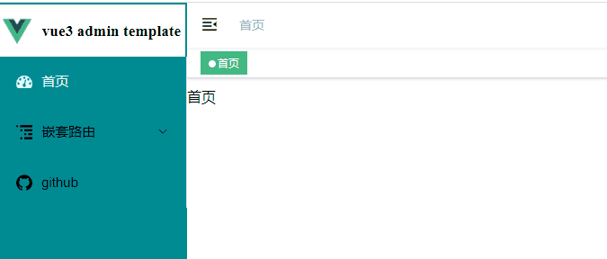
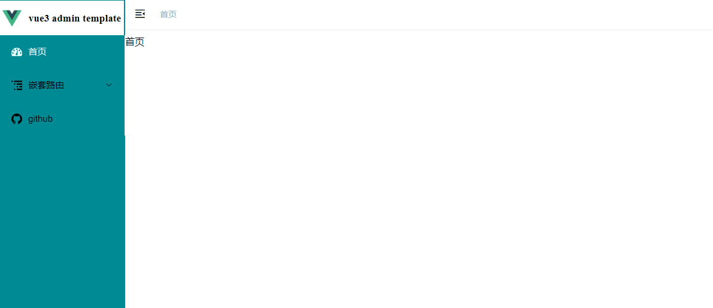

# 项目实现——标准版

&emsp;&emsp;在标准版中，会增加以下功能：   

1. 由于`Element UI Plus`系统本身提供的图标并不多，而且`png`图片会存在一定的失真，因此本项目使用`svg`管理所有的图标系统。    
2. 目前一些状态信息是存放在浏览器的`localStorage`中，安全性较低，本项目使用`pinia`管理项目中所有的信息系统。    
3. 优化全局布局组件系统，扩展功能。      

## 全局图标系统

### 安装

```cmd
npm install svg-sprite-loader -D
```

### Svg图标组件

&emsp;&emsp;在`src`文件夹下新建`icons`文件夹，用来处理全局图标系统。然后新建`index.vue`文件和`svg`文件夹，其中`svg`文件夹下存放所有的`.svg`图标文件。    

* `src->icons->index.vue`：     

```html
<template>
  <svg :class="svgClass" aria-hidden="true">
    <use :xlink:href="iconName" />
  </svg>
</template>
```

```ts
<script setup lang="ts">
import { computed, defineProps } from 'vue'

const props = defineProps({
  iconClass: {
    type: String,
    required: true
  },
  className: {
    type: String,
    default: ''
  }
})

const iconName = computed(() => `#icon-${props.iconClass}`)
const svgClass = computed(() => {
  if (props.className) {
    return 'svg-icon ' + props.className
  } else {
    return 'svg-icon'
  }
})
</script>
```

```css
<style lang="scss" scoped>
.svg-icon {
  /* 调整大小 */
  width: 1.3em;
  height: 1.3em;
  vertical-align: -0.3em;
  fill: currentColor;
  overflow: hidden;
}

.svg-external-icon {
  background-color: currentColor;
  mask-size: cover!important;
  display: inline-block;
}
</style>
```

### vite配置

&emsp;&emsp;在`src`文件夹下新建`plugins`，用于存放项目中的插件系统，然后新建`svgBuilder.ts`：    

```ts
import { Plugin } from 'vite'
import { readFileSync, readdirSync, PathLike } from 'fs'

// 参考：https://github.com/JetBrains/svg-sprite-loader/issues/434

let idPerfix = ''
const svgTitle = /<svg([^>+].*?)>/
const clearHeightWidth = /(width|height)="([^>+].*?)"/g

const hasViewBox = /(viewBox="[^>+].*?")/g

const clearReturn = /(\r)|(\n)/g

function findSvgFile(dir:PathLike): string[] {
  const svgRes = []
  const dirents = readdirSync(dir, {
    withFileTypes: true
  })
  for (const dirent of dirents) {
    if (dirent.isDirectory()) {
      svgRes.push(...findSvgFile(dir + dirent.name + '/'))
    } else {
      const svg = readFileSync(dir + dirent.name)
        .toString()
        .replace(clearReturn, '')
        .replace(svgTitle, ($1, $2) => {
          // console.log(++i)
          // console.log(dirent.name)
          let width = 0
          let height = 0
          let content = $2.replace(
            clearHeightWidth,
            (s1:unknown, s2:string, s3:number) => {
              if (s2 === 'width') {
                width = s3
              } else if (s2 === 'height') {
                height = s3
              }
              return ''
            }
          )
          if (!hasViewBox.test($2)) {
            content += `viewBox="0 0 ${width} ${height}"`
          }
          return `<symbol id="${idPerfix}-${dirent.name.replace(
            '.svg',
            ''
          )}" ${content}>`
        })
        .replace('</svg>', '</symbol>')
      svgRes.push(svg)
    }
  }
  return svgRes
}

export const svgBuilder = (
  path: string,
  perfix = 'icon'
): Plugin | null => {
  if (path === '') return null
  idPerfix = perfix
  const res = findSvgFile(path)
  // console.log(res.length)
  // const res = []
  return {
    name: 'svg-transform',
    transformIndexHtml(html): string {
      return html.replace(
        '<body>',
        `
          <body>
            <svg xmlns="http://www.w3.org/2000/svg" xmlns:xlink="http://www.w3.org/1999/xlink" style="position: absolute; width: 0; height: 0">
              ${res.join('')}
            </svg>
        `
      )
    }
  }
}
```

&emsp;&emsp;并在`vite.config.ts`中配置：

```ts
// 引入svgBuilder插件
import { svgBuilder } from './src/plugins/svgBuilder'

export default defineConfig({
  plugins: [svgBuilder('./src/icons/svg/')], // 一次性添加所有的svg 无需在单独导入
})
```

&emsp;&emsp;这里如果提示不能找到该`ts`文件，需要在`tsconfig.node.json`中添加该文件：    

```json
"include": ["vite.config.ts", "./src/plugins/svgBuilder.ts"]
```

### main.ts配置

&emsp;&emsp;最后将其配置到`main.ts`中，注册组件：

```ts
// 引入svg
import svgIcon from '@/icons/index.vue'
// 注册svg组件
app.component('svg-icon', svgIcon)
```

### 使用

&emsp;&emsp;例如，在全局布局组件系统中的菜单栏组件所有的图标改成`svg`的形式：    

* `src->layout->components->sidebar->item.vue`：   

```html
<template>
  <div class="item-div">
    <!-- 图标/图片 + 标题 -->
    <i v-if="(props.icon).includes('el-icon')" class="sub-el-icon"></i>
    <svg-icon v-else :icon-class="props.icon"></svg-icon>
    <span>{{ props.title }}</span>
  </div>
</template>
```

&emsp;&emsp;这里主要通过路由配置文件中每个路由的`icon`参数来选择相应的图标。(默认已经将`svg`图标放在`src->icons->svg`中。)     
&emsp;&emsp;注1：如果不能看到效果，需要重启项目。    
&emsp;&emsp;注2：[iconfont图标库](https://www.iconfont.cn/)  

## 全局状态系统

### 安装

```cmd
npm install pinia
```

### main.ts配置

```ts
import { createPinia } from 'pinia'
// 使用Pinia
app.use(createPinia())
```

### 使用

&emsp;&emsp;在`src`目录下新建`store`文件夹，存放所有的状态管理文件。     
&emsp;&emsp;`pinia`样例文件：     

* `src->store->example.ts`：  

```ts
import { defineStore } from 'pinia'

// 规范写法：use[name]Store
export const useExampleStore = defineStore({
  // store
  id: 'example',
  state: () => ({
    key: 'value' as string,
  }),
  // getters
  getters: {
    newKey() {
      this.key = newValue
    }
  },
  // actions
  actions: {
    functionName(newValue:string) {
      this.key = newValue
    }
  }
})
```

## 全局布局组件系统优化

### 增加菜单栏显示/隐藏功能

     
&emsp;&emsp;该功能主要是实现点击切换按钮时，菜单栏会只显示图标部分，隐藏所有的文字部分，再次点击时，会恢复初始状态，且菜单栏宽度保持自适应状态。   

#### 状态管理设置

&emsp;&emsp;首先在`src->store`文件夹中，新建`app.ts`，用于存放当前设备的状态。    

* `src->store->app.ts`：   

```ts
import { defineStore } from 'pinia'
// npm install js-cookie --save
import Cookies from 'js-cookie'

export const useAppStore = defineStore({
  id: 'app',
  state: () => ({
    sidebar: {
      // !!:转为布尔值
      // 保存当前菜单栏显示和隐藏的状态
      opened: Cookies.get('sidebarStatus') ? !!Cookies.get('sidebarStatus') : true as boolean,
      withoutAnimation: false as boolean
    },
    device: 'desktop' as string
  }),

  actions: {
    // 控制菜单栏显示和隐藏的切换
    toggleSideBar() {
      this.sidebar.opened = !this.sidebar.opened
      this.sidebar.withoutAnimation = false
      if (this.sidebar.opened) {
        Cookies.set('sidebarStatus', 1)
      } else {
        Cookies.set('sidebarStatus', 0)
      }
    }
  }
})
```

#### 切换组件实现

&emsp;&emsp;然后在`src`文件夹中新建`components`文件夹，该文件夹主要存放非页面级的组件。     
&emsp;&emsp;在该文件夹下新建控制菜单栏显示切换的图标组件：   

* `src->components->Hamburger->index.vue`： 

```html
<template>
  <div style="padding: 0 15px;" @click="toggleClick">
    <!-- svg图标 -->
    <svg
      :class="{'is-active':props.isActive}"
      class="hamburger"
      viewBox="0 0 1024 1024"
      xmlns="http://www.w3.org/2000/svg"
      width="64"
      height="64"
    >
      <path d="M408 442h480c4.4 0 8-3.6 8-8v-56c0-4.4-3.6-8-8-8H408c-4.4 0-8 3.6-8 8v56c0 4.4 3.6 8 8 8zm-8 204c0 4.4 3.6 8 8 8h480c4.4 0 8-3.6 8-8v-56c0-4.4-3.6-8-8-8H408c-4.4 0-8 3.6-8 8v56zm504-486H120c-4.4 0-8 3.6-8 8v56c0 4.4 3.6 8 8 8h784c4.4 0 8-3.6 8-8v-56c0-4.4-3.6-8-8-8zm0 632H120c-4.4 0-8 3.6-8 8v56c0 4.4 3.6 8 8 8h784c4.4 0 8-3.6 8-8v-56c0-4.4-3.6-8-8-8zM142.4 642.1L298.7 519a8.84 8.84 0 0 0 0-13.9L142.4 381.9c-5.8-4.6-14.4-.5-14.4 6.9v246.3a8.9 8.9 0 0 0 14.4 7z" />
    </svg>
  </div>
</template>
```

```ts
<script setup lang="ts">
import { defineProps, defineEmits } from 'vue'

const props = defineProps({
  isActive: {
    type: Boolean,
    default: false
  }
})

// 获取父组件函数
const emit = defineEmits(['toggleClick'])

// 切换按钮
const toggleClick = () => {
  emit('toggleClick')
}

</script>
```

#### 导航栏组件调整

&emsp;&emsp;`Hamburger`组件主要是存放在导航栏组件的左侧，菜单栏组件的右侧，因此在父组件导航栏组件中，引入该图标组件：  

* `src->layout->components->Narbar.vue`：   

```html
<!-- 控制菜单栏的显示 -->
<hamburger
  id="hamburger-container"
  :is-active="sidebar.opened"
  class="hamburger-container"
  @toggleClick="toggleSideBar" />
```

```ts
import Hamburger from '@/components/Hamburger/index.vue'

import { computed, reactive } from 'vue'

import { useAppStore } from '@/store/app'

const appStore = useAppStore()

const sidebar = computed(() => appStore.sidebar)

// 侧边栏控制
const toggleSideBar = () => {
  appStore.toggleSideBar()
}
```

&emsp;&emsp;注：这里只显示和之前代码有变化的部分，下同。   

#### 菜单栏组件调整

&emsp;&emsp;首先将`Logo.vue`组件设置为根据`collapse`状态控制是否显示标题：  

* `src->layout->components->Sidebar->Logo.vue`：  

```html
<template>
  <div class="sidebar-logo-container" :class="{'collapse':collapse}">
    <!-- 跳转到首页 -->
    <transition name="sidebarLogoFade">
      <!-- 根据collapse控制Logo组件，即是否显示标题 -->
      <router-link v-if="collapse" key="collapse" class="sidebar-logo-link" to="/">
        
        <h1 v-else class="sidebar-title">{{ logoInfo.title }} </h1>
      </router-link>
      <router-link v-else key="expand" class="sidebar-logo-link" to="/">
        
        <h1 class="sidebar-title">{{ logoInfo.title }} </h1>
      </router-link>
    </transition>
  </div>
</template>
```

```ts
import { defineProps, reactive } from 'vue'

defineProps({
  collapse: {
    type: Boolean,
    require: true
  }
})
```

&emsp;&emsp;使用`v-if`和`v-else`指令，结合传入的`collapse`状态值，实时切换是否显示标题文字。    
&emsp;&emsp;然后修改`Logo.vue`的父组件`index.vue`，将状态管理中的`sidebar`值实时传递给`Logo.vue`组件：

```html
<!-- 左上角图标 -->
<logo :collapse="isCollapse"/>
```

```ts
import { computed } from 'vue'

import { useAppStore } from '@/store/app'

const appStore = useAppStore()

const isCollapse = computed(() => !appStore.sidebar.opened)
```

&emsp;&emsp;菜单选项组件的显示和隐藏主要通过样式来控制(`src->style->sidebar.module.scss`)。    

### 增加导航栏面包屑功能

      
&emsp;&emsp;该功能主要实现在导航栏上实时显示当前路由的地址，如果是嵌套路由则会根据嵌套规则显示完整的路由地址，并且点击相应的路由标题时，会切换到相应的界面。      

#### 面包屑组件实现

&emsp;&emsp;在`src->compnents`目录下新建`Hamburger->index.vue`组件，实现面包屑功能：    

```html
<template>
  <el-breadcrumb class="app-breadcrumb" separator="/">
    <transition-group name="breadcrumb">
      <!-- 面包屑组件 -->
      <el-breadcrumb-item v-for="(item,index) in breadcrumbInfo.levelList" :key="item.path">
        <span
          v-if="item.redirect==='noRedirect'||index==breadcrumbInfo.levelList.length-1"
          class="no-redirect">
          {{ item.meta.title }}</span>
        <a v-else @click.prevent="handleLink(item)">{{ item.meta.title }}</a>
      </el-breadcrumb-item>
    </transition-group>
  </el-breadcrumb>
</template>
```

```ts
<script setup lang="ts">
// npm install path-to-regexp
import * as pathToRegexp from 'path-to-regexp'

import { reactive, watch } from 'vue'

import { useRoute, useRouter, RouteRecordRaw } from 'vue-router'

const route = useRoute()
const router = useRouter()

const breadcrumbInfo = reactive({
  levelList: [] as Array<RouteRecordRaw> | any
})

// 监测当前的路由变化
watch(route, () => {
  // if you go to the redirect page, do not update the breadcrumbs
  if (route.path.startsWith('/redirect/')) {
    return
  }
  // 更新面包屑路由
  getBreadcrumb()
})

const getBreadcrumb = () => {
  // 只显示含有 meta.title 属性的路由
  let matched:Array<any> = route.matched.filter(item => item.meta && item.meta.title)

  const first = matched[0]

  // 如果不是首页，则加上首页的面包屑
  if (!isDashboard(first)) {
    matched = [{ path: '/dashboard', meta: { title: '首页' }}].concat(matched)
  }

  // 再次过滤 满足指定条件
  breadcrumbInfo.levelList = matched.filter(item => item.meta && item.meta.title && item.meta.breadcrumb !== false)
}

// 判断是否是首页路由
const isDashboard = (route:RouteRecordRaw) => {
  const name = route && route.name as string
  if (!name) {
    return false
  }
  return name.trim().toLocaleLowerCase() === 'Dashboard'.toLocaleLowerCase()
}

// 点击面包屑跳转路由
const handleLink = (item:RouteRecordRaw) => {
  const { redirect, path } = item
  // 如果存在 redirect 属性(此时是嵌套路由) 则直接跳转至该路由
  if (redirect) {
    router.push(redirect as string)
    return
  }
  // 跳转至编译后的路由
  router.push(pathCompile(path))
}

// 编译路由
const pathCompile = (path:string) => {
  // 解决带有参数的路由跳转问题
  // To solve this problem https://github.com/PanJiaChen/vue-element-admin/issues/561
  const { params } = route
  const toPath = pathToRegexp.compile(path)
  return toPath(params)
}

// 初始化刷新路由
getBreadcrumb()
</script>
```

&emsp;&emsp;其主要原理就是实时监测当前路由的变化，并根据当前路由的参数遍历生成面包屑路由，并将首页路由添加至面包屑开始位置，通过点击面包屑中显示的路由标题，实现路由的切换。    

#### 导航栏组件调整

&emsp;&emsp;最后将其添加至父组件导航栏组件中：   

* `src->components->Narbar.vue`：   

```html
<breadcrumb id="breadcrumb-container" class="breadcrumb-container" />
```

```ts
import Breadcrumb from '@/components/Breadcrumb/index.vue'
```

### 增加标签栏导航功能

       
&emsp;&emsp;该功能主要实现在导航栏上保存已经访问过的路由，点击相应标签即可切换至相应路由，并且可以实现关闭其他、全部关闭路由等功能。     

#### 路由标签状态管理

&emsp;&emsp;首先在`src->store`文件夹中，新建`tagsViews.ts`，用于存放已访问的路由和缓存的路由，并实现添加路由、删除路由等功能。     

```ts
import { defineStore } from 'pinia'
import { RouteRecordRaw, RouteRecordName, RouteLocationNormalizedLoaded } from 'vue-router'

interface TagsViewsIF extends RouteLocationNormalizedLoaded {
  title?: string
  meta: {
    title?: string,
    noCache?: boolean,
    affix?: boolean
  }
}

interface AllViewsTF {
  visitedViews: Array<TagsViewsIF>,
  cachedViews: Array<RouteRecordName | null | undefined>
}

// 标签栏导航
export const useTagsViewStore = defineStore({
  id: 'tagsView',
  state: () => ({
    // 定义数据类型
    // 用户访问过的页面
    visitedViews: [] as Array<TagsViewsIF>,
    // 实际keep-alive的路由
    cachedViews: [] as Array<RouteRecordName | null | undefined>
  }),
  actions: {
    // 增加导航路由
    addView(view:TagsViewsIF) {
      this.addVisitedView(view)
      this.addCachedView(view)
    },
    addVisitedView(view:TagsViewsIF) {
      if (this.visitedViews.some(v => v.path === view.path)) return

      this.visitedViews.push(
        Object.assign({}, view, { title: view.meta.title || 'no-name' })
      )
    },
    addCachedView(view:TagsViewsIF) {
      if (this.cachedViews.includes(view.name)) return
      if (!view.meta.noCache) {
        this.cachedViews.push(view.name)
      }
    },
    // 删除导航路由
    delView(view: TagsViewsIF) {
      return new Promise<AllViewsTF>(resolve => {
        this.delVisitedView(view)
        this.delCachedView(view)

        resolve({
          visitedViews: [...this.visitedViews],
          cachedViews: [...this.cachedViews]
        })
      })
    },
    delVisitedView(view: TagsViewsIF) {
      return new Promise<Array<TagsViewsIF>>(resolve => {
        for (const [i, v] of this.visitedViews.entries()) {
          if (v.path === view.path) {
            this.visitedViews.splice(i, 1)
            break
          }
        }

        resolve([...this.visitedViews])
      })
    },
    delCachedView(view: TagsViewsIF) {
      return new Promise<Array<RouteRecordName | null | undefined>>(resolve => {
        const index = this.cachedViews.indexOf(view.name)
        index > -1 && this.cachedViews.splice(index, 1)

        resolve([...this.cachedViews])
      })
    },
    delOthersViews(view: TagsViewsIF) {
      return new Promise<AllViewsTF>(resolve => {
        this.delOthersVisitedViews(view)
        this.delOthersCachedViews(view)

        resolve({
          visitedViews: [...this.visitedViews],
          cachedViews: [...this.cachedViews]
        })
      })
    },
    delOthersVisitedViews(view: TagsViewsIF) {
      return new Promise<Array<TagsViewsIF>>(resolve => {
        this.visitedViews = this.visitedViews.filter((v:any) => {
          return v.meta.affix || v.path === view.path
        })

        resolve([...this.visitedViews])
      })
    },
    delOthersCachedViews(view: TagsViewsIF) {
      return new Promise<Array<RouteRecordName | null | undefined>>(resolve => {
        const index = this.cachedViews.indexOf(view.name)
        if (index > -1) {
          this.cachedViews = this.cachedViews.slice(index, index + 1)
        } else {
          // if index = -1, there is no cached tags
          this.cachedViews = []
        }

        resolve([...this.cachedViews])
      })
    },
    // 删除所有
    delAllViews() {
      return new Promise<AllViewsTF>(resolve => {
        this.delAllVisitedViews()
        this.delAllCachedViews()

        resolve({
          visitedViews: [...this.visitedViews],
          cachedViews: [...this.cachedViews]
        })
      })
    },
    delAllVisitedViews() {
      return new Promise<Array<TagsViewsIF>>(resolve => {
        const affixTags = this.visitedViews.filter((tag:any) => tag.meta.affix)
        this.visitedViews = affixTags

        resolve([...this.visitedViews])
      })
    },
    delAllCachedViews() {
      return new Promise<Array<RouteRecordName | null | undefined>>(resolve => {
        this.cachedViews = []

        resolve([...this.cachedViews])
      })
    },
    // 更新导航视图
    updateVisitedView(view: TagsViewsIF) {
      for (let v of this.visitedViews) {
        if (v.path === view.path) {
          v = Object.assign(v, view)
          break
        }
      }
    }
  }
})
```

#### 标签组件实现

&emsp;&emsp;在`src->layout->components`下新建`TagsView`文件夹，并在该文件夹下新建`index.vue`和`ScrollPane.vue`。     

* `src->layout->components->TagsView->ScrollPane.vue`：   

```html
<template>
  <el-scrollbar
    ref="scrollContainerRef"
    :vertical="false"
    class="scroll-container"
    @wheel.native.prevent="handleScroll">
    <slot />
  </el-scrollbar>
</template>
```

```ts
<script setup lang="ts">
import { computed } from '@vue/reactivity'
import { ref } from 'vue'
import type { ElScrollbar } from 'element-plus'

const scrollContainerRef:any = ref<InstanceType<typeof ElScrollbar>>()

const scrollWrapper = computed(() => {
  return scrollContainerRef.value.$refs.wrap$
})

// 处理鼠标滚动事件
const handleScroll = (e:any) => {
  // 超出范围时 滚动向左向右平移
  const eventDelta = e.wheelDelta || -e.deltaY * 40
  scrollWrapper.value.scrollLeft -= eventDelta / 4
}
</script>
```

* `src->layout->components->TagsView->index.vue`：

```html
<template>
  <div id="tags-view-container" class="tags-view-container">
    <scroll-pane ref="scrollPaneRef" class="tags-view-wrapper" @scroll="handleScroll">
      <!-- :to: 点击会跳转至相应路由 -->
      <!-- click.middle.native: 按下鼠标中键关闭标签导航 -->
      <router-link
        v-for="tag in visitedViews"
        ref="routerLinkRef"
        :key="tag.path"
        :class="isActive(tag) ? 'active' : '' "
        :to="{ path: tag.path, query: tag.query, fullPath: tag.fullPath }"
        tag="span"
        class="tags-view-item"
        @click.middle.native="!isAffix(tag) ? closeSelectedTag(tag) : '' "
        @contextmenu.prevent.native="openMenu(tag, $event)"
      >
        {{ tag.title }}
        <span v-if="!isAffix(tag)" class="el-icon-close" @click.prevent.stop="closeSelectedTag(tag)" />
      </router-link>
    </scroll-pane>
    <!-- 下拉选择框 -->
    <ul
      v-show="tagsViewInfo.visible"
      :style="{ left: tagsViewInfo.left + 'px',top: tagsViewInfo.top + 'px' }"
      class="contextmenu">
      <li @click="refreshSelectedTag(tagsViewInfo.selectedTag)">刷新</li>
      <li v-if="!isAffix(tagsViewInfo.selectedTag)" @click="closeSelectedTag(tagsViewInfo.selectedTag)">关闭</li>
      <li @click="closeOthersTags">关闭其他</li>
      <li @click="closeAllTags(tagsViewInfo.selectedTag)">关闭所有</li>
    </ul>
  </div>
</template>
```

```ts
<script setup lang="ts">
import ScrollPane from './ScrollPane.vue'
import { nextTick, onMounted, reactive, ref, watch, getCurrentInstance, ComponentInternalInstance } from 'vue'
import { computed } from '@vue/reactivity'

import { useRoute, useRouter, RouteRecordRaw, RouteRecordName, RouteLocationNormalizedLoaded } from 'vue-router'
import { useTagsViewStore } from '@/store/tagsViews'

import { constantRoutes } from '@/router/index'

// 使用 path-browserify 代替 path 模块
import path from 'path-browserify'

const route = useRoute()
const router = useRouter()

const tagsViewStore = useTagsViewStore()

const routerLinkRef = ref<any>([])
const scrollPaneRef = ref()

// 获取当前实例
// setup执行时 组件还没有创建 无法直接获取实例
const { proxy } = getCurrentInstance() as ComponentInternalInstance

interface TagsViewsIF extends RouteLocationNormalizedLoaded {
  title?: string
  meta: {
    title?: string,
    noCache?: boolean,
    affix?: boolean
  }
}

const tagsViewInfo = reactive({
  visible: false,
  top: 0,
  left: 0,
  selectedTag: {} as TagsViewsIF,
  affixTags: [] as Array<TagsViewsIF>
})

// 访问过的路由
const visitedViews = computed(() => {
  return tagsViewStore.visitedViews
})

const routes = computed(() => {
  return constantRoutes
})

// 监视路由变化
watch(route, () => {
  addTags()
})

// 监视 tagsViewInfo 对象的 visible 值
watch(() => tagsViewInfo.visible, (newValue) => {
  if (newValue) {
    document.body.addEventListener('click', closeMenu)
  } else {
    document.body.removeEventListener('click', closeMenu)
  }
})

// 初始化
onMounted(() => {
  initTags()
  addTags()
})

// 初始化标签
const initTags = () => {
  // 获取需要展示在标签导航中的路由(meta 的 affix 属性值为 true)
  const affixTags = tagsViewInfo.affixTags = filterAffixTags(routes.value)
  for (const tag of affixTags) {
    // Must have tag name
    if (tag.name) {
      // 存储初始化的标签
      tagsViewStore.addVisitedView(tag)
    }
  }
}

// 将当前路由存储至标签中
const addTags = () => {
  const { name } = route
  if (name) {
    tagsViewStore.addView(route)
  }
  return false
}

// 判断当前路由是否处于激活状态
const isActive = (currentRoute:TagsViewsIF) => {
  return currentRoute.path === route.path
}

// 判断标签是否固定
const isAffix = (tag:TagsViewsIF) => {
  return tag.meta && tag.meta.affix
}

// 过滤路由中含有 meta.affix 属性值的
const filterAffixTags = (routes:RouteRecordRaw[], basePath = '/') => {
  let tags:Array<any> = []
  routes.forEach(route => {
    // 如果路由有 meta 属性值，且 meta 的 affix 属性值为 true
    if (route.meta && route.meta.affix) {
      const tagPath = path.resolve(basePath, route.path)
      // 添加至 标签数组 中
      tags.push({
        fullPath: tagPath,
        path: tagPath,
        name: route.name as string,
        meta: { ...route.meta }
      })
    }
    // 如果路由有子路由
    if (route.children) {
      const tempTags = filterAffixTags(route.children, route.path)
      if (tempTags.length >= 1) {
        tags = [...tags, ...tempTags]
      }
    }
  })
  return tags
}

// 刷新当前路由
const refreshSelectedTag = (view: TagsViewsIF) => {
  tagsViewStore.delCachedView(view).then(() => {
    const { fullPath } = view
    nextTick(() => {
      router.replace({
        path: fullPath
      })
    })
  })
}

// 关闭当前路由
const closeSelectedTag = (view: TagsViewsIF) => {
  tagsViewStore.delView(view).then(({ visitedViews }) => {
    if (isActive(view)) {
      toLastView(visitedViews, view)
    }
  })
}

// 关闭其他路由
const closeOthersTags = () => {
  router.push(tagsViewInfo.selectedTag)
  tagsViewStore.delOthersViews(tagsViewInfo.selectedTag)
}

// 关闭所有路由
const closeAllTags = (view: TagsViewsIF) => {
  tagsViewStore.delAllViews().then(({ visitedViews }) => {
    if (tagsViewInfo.affixTags.some(tag => tag.path === view.path)) {
      return
    }
    toLastView(visitedViews, view)
  })
}

// 定位最后一次访问的路由
const toLastView = (visitedViews:Array<TagsViewsIF>, view: TagsViewsIF) => {
  const latestView = visitedViews.slice(-1)[0]
  if (latestView) {
    router.push(latestView.fullPath)
  } else {
    // now the default is to redirect to the home page if there is no tags-view,
    // you can adjust it according to your needs.
    if (view.name === 'Dashboard') {
      // to reload home page
      router.replace({ path: '/redirect' + view.fullPath })
    } else {
      router.push('/')
    }
  }
}

// 右击打开标签菜单
const openMenu = (tag:RouteLocationNormalizedLoaded, e:PointerEvent) => {
  const menuMinWidth = 105
  const offsetLeft = (proxy as any).$el.getBoundingClientRect().left // container margin left
  const offsetWidth = (proxy as any).$el.offsetWidth // container width
  const maxLeft = offsetWidth - menuMinWidth // left boundary
  const left = e.clientX - offsetLeft + 15 // 15: margin right

  if (left > maxLeft) {
    tagsViewInfo.left = maxLeft
  } else {
    tagsViewInfo.left = left
  }

  tagsViewInfo.top = e.clientY
  tagsViewInfo.visible = true
  tagsViewInfo.selectedTag = tag
}

// 关闭下拉菜单
const closeMenu = () => {
  tagsViewInfo.visible = false
}

// 处理滚动事件
const handleScroll = () => {
  // 鼠标滚动时 关闭下拉菜单显示
  closeMenu()
}
</script>
```

&emsp;&emsp;其主要原理就是首先将访问过的路由依次显示在滚动条组件中，然后通过鼠标右击事件弹出功能菜单，并通过定义在`tagsViewStore`里面的功能实现相应的功能。      

#### 全局布局组件调整

&emsp;&emsp;最后将其添加至父组件全局布局组件中：   

* `src->layout->index.vue`：   

```html
<div>
  <!-- 导航栏 -->
  <navbar />
  <tags-view/>
</div>
```

```ts
import TagsView from './components/TagsView/index.vue'
```
